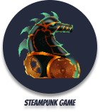

# Steampunk Game

## A smart and simple game. **Try it out!**

### This game is based on HTML, CSS and JavaScript, so you can run it easily


- ✏️ Based on a game by Frank's Laboratory. **[YouTube | Frank's Laboratory](https://www.youtube.com/c/Frankslaboratory)**

- 🚀 Owner: FleetAdmiralJakob **[GitHub | FleetAdmiralJakob](https://github.com/FleetAdmiralJakob)**

- 📜 License: MIT

- 💞️ At the moment I'm also looking for someone who wants to develop this game with me.

- 📫 How to reach me: jakob.roessner@outlook.de

- 📖 For more questions: We have an awesome wiki which you can find here: **[GitHub | Steampunk Game | Wiki](https://github.com/FleetAdmiralJakob/Steampunk-Game/wiki)**

---

## Contributors ✨

Thanks goes to these wonderful people who have improved the code and documentation to help this project grow. ([emoji key](https://allcontributors.org/docs/en/emoji-key)):

<table>
  <tbody>
    <tr>
      <td align="center"><a href="https://github.com/FleetAdmiralJakob"><br /><sub><b>Jakob Felix Eugen Rössner</b></sub></a><br /><a href="" title="Content">🖋</a><a href="https://linkshortner.net/BqtCK" title="Code">💻</a><a href="" title="Documentation">📖</a><a href="" title="Project Management">📆</a></td>
    </tr>
  </tbody>
  <tfoot>
  </tfoot>
</table>

Contributions of any kind are welcome!

---

## 👷‍♂️ Access the Project

[Access the source code here on GitHub. 🔗](https://github.com/FleetAdmiralJakob/Steampunk-Game/tree/main)

[Download here the source code in .zip format. 🔗](https://github.com/FleetAdmiralJakob/Steampunk-Game/archive/refs/heads/main.zip)

Clone the repository:

```
git clone https://github.com/FleetAdmiralJakob/Steampunk-Game.git
```
---
## 🔧 Technologies

<div>
  
  
  
</div>
